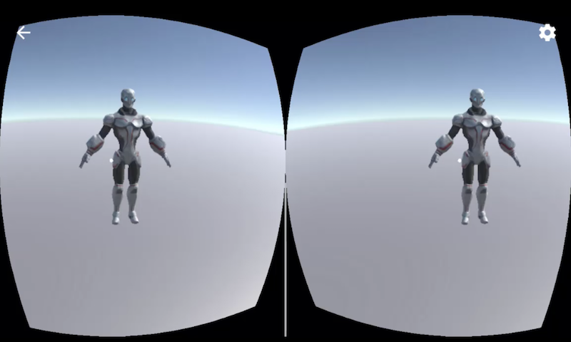

# Virtual Reality Sample using IBM Watson, Unity and Google Cardboard

This project contains a simple Virtual Reality application which allows iPhone users with a Google Cardboard to move a player via voice commands and to ask a 3D character for weather information.

Check out the [video](https://www.youtube.com/watch?v=dAgqvRs0ZaQ) for a short demo.

The picture shows a screenshot of the two cameras showing the 3D character. Users can move the player via voice commands and can have conversations with the character, for example:

* User: Start to walk.
* User: Stop.
* User: How is the weather?
* Character: In which location?
* User: Munich.
* Character: The temperature in Munich is currently 24 degrees.
* User: How is the weather in Berlin?
* Character: The temperature in Berlin is currently 28 degrees.

Technically the following services and tools are used:

* [Unity](https://unity3d.com/unity)
* [IBM Watson SDK for Unity](https://github.com/watson-developer-cloud/unity-sdk)
* [IBM Watson Speech To Text](https://www.ibm.com/watson/services/speech-to-text/)
* [IBM Watson Assistant](https://www.ibm.com/watson/services/conversation/)
* [IBM Watson Text To Speech](https://www.ibm.com/watson/services/text-to-speech/)
* [Weather Company Data](https://console.bluemix.net/catalog/services/weather-company-data)
* [Google Cardboard](https://vr.google.com/cardboard/)

# Setup

Clone this repo and open the directory 'SimpleVR' in Unity.

Get an [IBM Cloud](https://ibm.biz/nheidloff) account. The lite account is free for one year (no credit card required) and supports the Watson services used in this sample.

Create a [Watson Assistant](https://console.bluemix.net/catalog/services/watson-assistant-formerly-conversation) instance and import [workspace.json](workspace.json) as a new workspace. Copy and paste the user name, user password and workspace id in [SoldierConvo.js](SimpleVR/Assets/SoldierConvo.js).

Create a [Watson Speech To Text](https://console.bluemix.net/catalog/services/speech-to-text) instance. Copy and paste the user name and user password in [SoldierConvo.js](SimpleVR/Assets/SoldierConvo.js).

Create a [Watson Text To Speech](https://console.bluemix.net/catalog/services/text-to-speech) instance. Copy and paste the user name and user password in [SoldierConvo.js](SimpleVR/Assets/SoldierConvo.js).

Create a [Weather Company Data](https://console.bluemix.net/catalog/services/weather-company-data) instance. Copy and paste the user name and user password in [SoldierConvo.js](SimpleVR/Assets/SoldierConvo.js).

Under [build settings](screenshots/ios-build-1.png) choose 'iOS' as platform. 

After this you can run the application from within Unity. See the example script above.

Optionally you can replace the cylinder with a better 3D character, for example the [cyber soldier](https://assetstore.unity.com/packages/3d/characters/robots/cyber-soldier-52064).

# Deployment to iPhone

Under iOS build/player settings some more properties need to be defined. See the [screenshots](screenshots) folder for more details.

For 'Company Name' and 'Bundle Identifier' use a name that follows the iOS bundle identifier naming convention, for example 'net.heidloff.sample'.

Add 'Cardboard' as virtual reality SDK under 'XR Settings'.

Select 'Mute Other Audio Sources', 'Prepare iOS for Recording', 'Force iOS Speakers when Recording' and 'Allow downloads over HTTP' under the 'Configuration' section.

Add a textural description for the microphone usage.

Click 'Build' to generate an iOS build and open the *.xcworkspace file (not the *.xcodeproj file).

In order to fix the signing issues, unfortunately you need to change the following settings in Xcode every time after you've generated a new build. See the [screenshots](screenshots) folder for more details.

Select 'Automatically manage signing' and your team under the 'General' tab.

With the 'Unity-iPhone' target selected, change all values to 'iOS Developer' for 'Code Signing Identity' on the 'Build Settings' tab.

With the 'Unity-iPhone Tests' target selected, change all values to 'iOS Developer' for 'Code Signing Identity' on the 'Build Settings' tab.

With the 'Unity-iPhone' project selected, change all values to 'iOS Developer' for 'Code Signing Identity' on the 'Build Settings' tab.

Connect your iPhone and press 'Build'. 

After you've accepted the usage of the microphone, you can run the sample app.